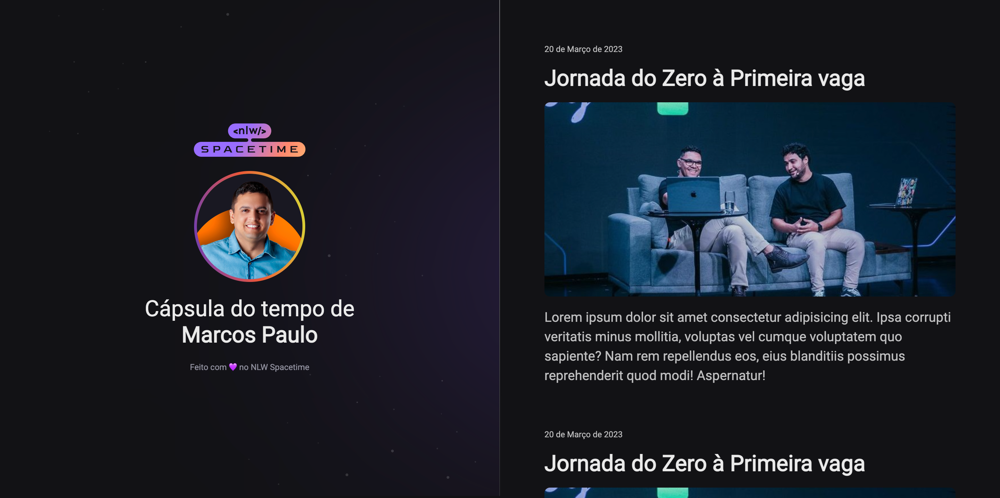

  

## 💻 Projeto
Esse é projeto web Responsivo de uma cápsula do tempo para exibir memórias em uma linha do tempo
## 🚀 Tecnologias
Esse projeto foi desenvolvido durante a NLW Spacetime da Rocketseat com as seguintes tecnologias:
- HTML
- CSS
- Git/Github

## 🔗 Layout
Você pode vusualizar o layount do projeto  [AQUI](https://www.figma.com/file/kQABS2Fw7FR4ytEgYiFIzG/C%C3%A1psula-do-tempo-%E2%80%A2-Trilha-Explorer-(Community)?type=design&node-id=0-1&t=i0A3Nfw3r8VcswCI-0)
É nesessário ter uma conta no [FIGMA](https://www.figma.com/)
